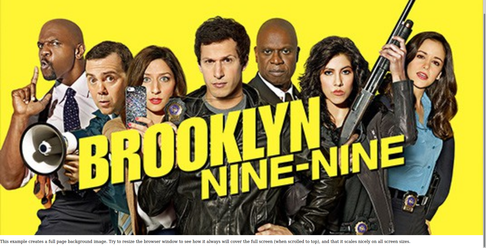
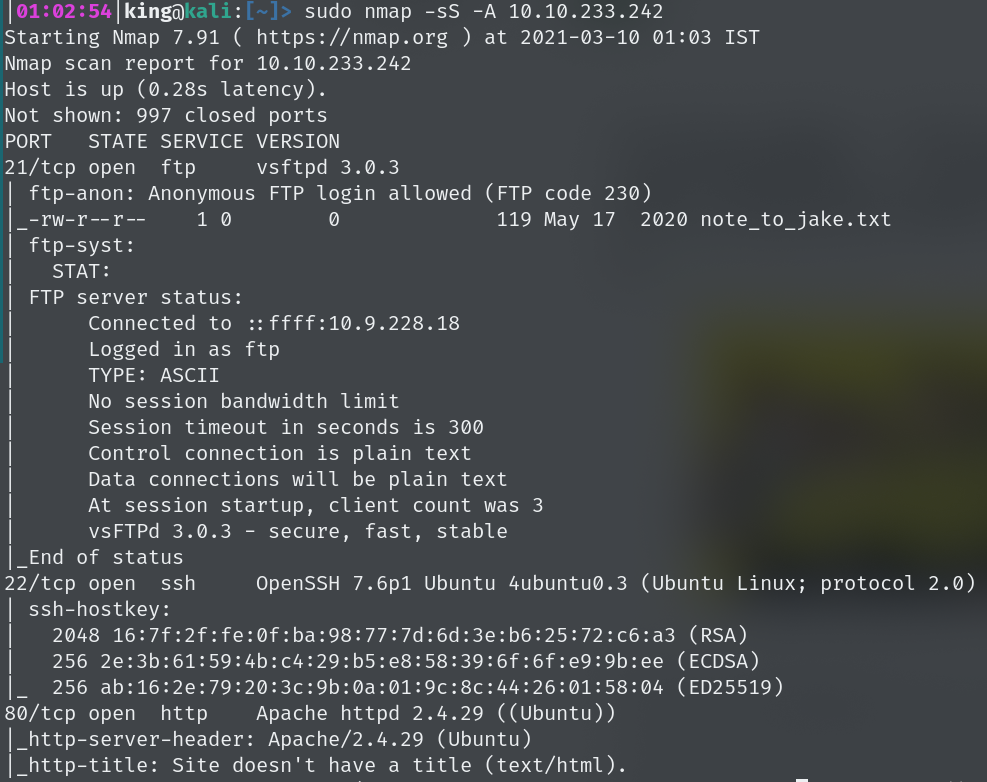
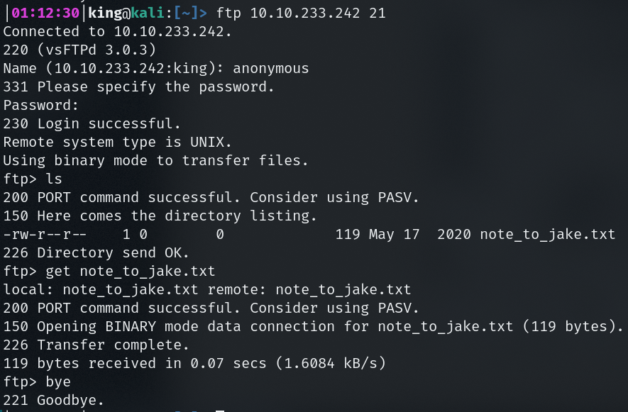
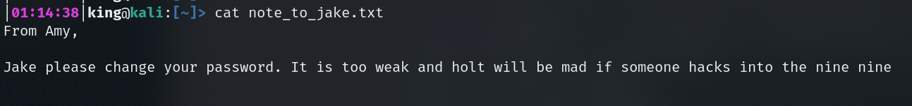
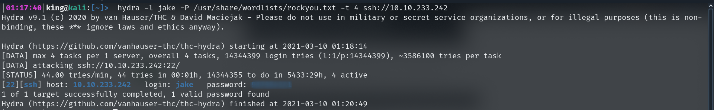
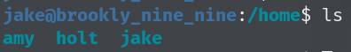
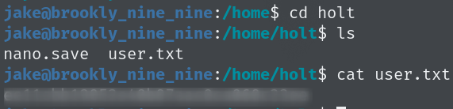
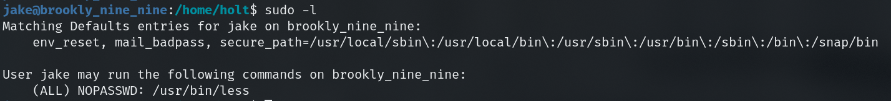
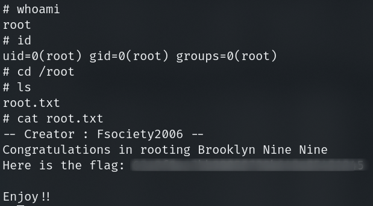

# TryHackMe --- Brooklyn Nine Nine CTF Walkthrough

 

So, Hey Guys This is Vikas Anand. This is my first ever CTF Walkthrough.

 

This CTF is from TryHackMe ["Brooklyn_Nine_Nine"](https://tryhackme.com/room/brooklynninenine) So join the Room and let's Hack the CTF cheers :)

 
First Scan the Machine with Nmap :

`
sudo nmap -sS -A 10.10.233.242
`

Here We can see 3 Ports Open :

1. 21 - ftp
2. 22 - ssh
3. 80 - http

After Enumerating ftp port we can see that it has anynomous login allowed. We, can simply login it through ftp 

`
ftp 10.10.233.242 21
`

*Name : anynomous* 
*pass : anynomous*

We can clearly see we have found a file named "note_to_jake.txt". Get the file in you system using _get_ command.

Now lets find What's inside it :

`cat note_to_jake.txt`

Here we can find there are 3 users :

* Any
* jake
* holt

Where, jake password is weak. Let's Bruteforce jake password using _hydra_ with port ssh open :

` hydra -l jake -P /usr/share/wordlists/rockyou.txt -t 4 ssh://10.10.233.242`

We, Successfully find the jake password. Let's dig into jake account using ssh

`ssh jake@10.10.233.242`

We find 3 users in home directory.

After Enumerating we find _user.txt_ flag in holt account.

Now we have to go into root account for this we have to esclate our privilages.

We can see _less_ is vulnerable we can go into root using _less_ command.

`sudo less user.txt`

`!/bin/sh`

Successfully We get root ! Now Let's find _root_ flag.

Awsoome we find our both the flag .

Thanks for reading the entire Walkthrough.

