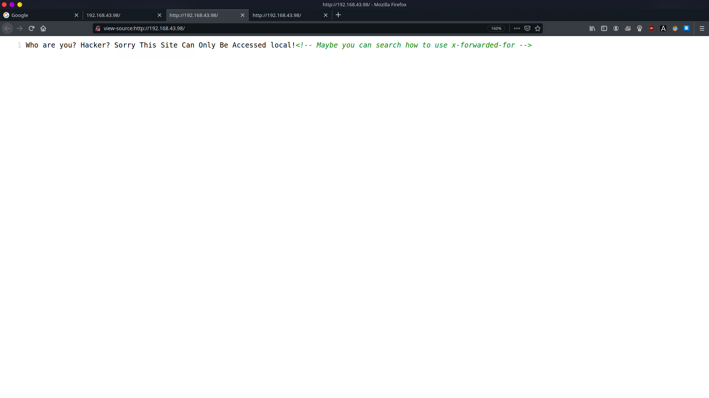

# VulnHub :  Me and My Girlfriend CTF Walkthrough

 

So, Hey Guys This is Vikas Anand. This is Second CTF Walkthrough.

 

This CTF is from VulnHub ["Me_and_My_Girlfriend"](https://www.vulnhub.com/entry/me-and-my-girlfriend-1,409/) So Download the CTF and let's Hack the CTF cheers

 

    First Find the IP address of the machine I'm using Netdiscover :

` sudo netdiscover `

Here the IP is _192.168.43.98_

    Then Scan the Machine with Nmap :

`
sudo nmap -A -O 192.168.43.98
`

Here We can see 2 Ports Open :

1. 22 - ssh
2. 80 - http

 
     
    Now check the http port website in firefox :
 

    After checking the source code of the website we get : 

 

    We can see that the site can be locally accesiible. So we will use Burpsuite x-forwared method :

* Goto Proxy
* Goto Options
* Goto Match and Replace
* CLick on the line where comment ="Add spoofed CORS origin"
* Replace with "x-forwarded-for:localhost"
* Click ok. Turn on the intercept
* Make sure your Firefox proxy is enable
* just reload the website then turn off the intercept
* Boom You'll see a Login Page.  

    Just click on Register and Enter any fake name,email,username and password. And login with the username and password.

We can see that the Password is shown but in dotted form. If we check the source page of this website we can clearly see the password.   

    Also we can see that this url id is 13. By changing url id we can see many username and passwords. In the id 5 we get,

    Also, In the Nmap scan we get ssh port open. Let's Connect SSH using this id and pass.

` ssh alice@192.168.43.98 `

    In the Alice Directory We get our first Flag.

    Now to get Second flag we have to escalate our privilages as root.

    We can see that php is Vulnerable so we will enjact some code of php to access the root.

`
variable="/bin/bash"
`
  
`
sudo /usr/bin/php -r "system('$variable');"
`

    Finally we Got our Both Flag. 

Thanks for reading the entire Walkthrough.